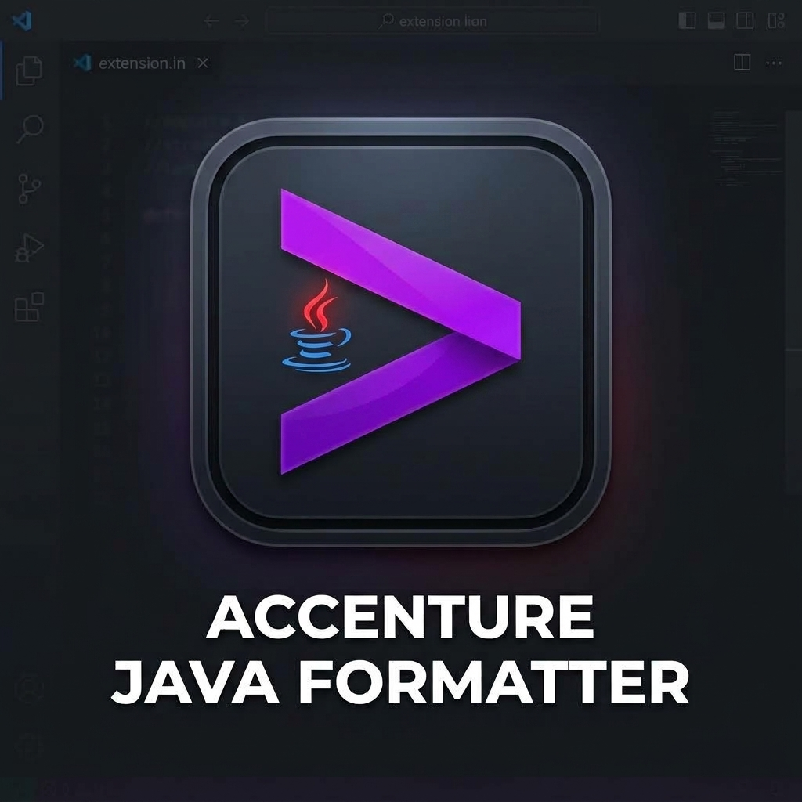

# Accenture Java Formatter (VS Code & IntelliJ IDEA)



[](https://plugins.jetbrains.com/plugin/34525)

> Enterprise-grade Java Code Formatter for **Visual Studio Code** and **IntelliJ IDEA** (Plugin ID: `34525`), implementing standardized Accenture Java Code Style rules.

> [!IMPORTANT]
> **🧪 Release v0.9.7**: This release brings **100% 1:1 Feature and Test Parity** across both Visual Studio Code and IntelliJ IDEA platforms, with full support for Java 15+ Text Blocks (`"""..."""`), string literal preservation, 70-column line wrapping, disabled-by-default format-on-save (`onSave: false`), and idempotent formatting.

The **Accenture Java Formatter** brings standardized Java code formatting, 2x continuation indentation, Eclipse JDT XML profile compatibility, intelligent import organization, and configurable code styles directly to Visual Studio Code and IntelliJ IDEA.

---

## 🔗 JetBrains Marketplace Links & Embed Widgets

- **JetBrains Marketplace Page**: [plugins.jetbrains.com/plugin/34525](https://plugins.jetbrains.com/plugin/34525)
- **Plugin ID**: `34525`

### Web Embed Snippets

#### 1. Marketplace Card Widget
```html
<script src="https://plugins.jetbrains.com/assets/scripts/mp-widget.js"></script>
<script>
  MarketplaceWidget.setupMarketplaceWidget('card', 34525, "#yourelement");
</script>
```

#### 2. Install Button Widget
```html
<script src="https://plugins.jetbrains.com/assets/scripts/mp-widget.js"></script>
<script>
  MarketplaceWidget.setupMarketplaceWidget('install', 34525, "#yourelement");
</script>
```

## 💻 Installation Instructions

### Visual Studio Code (.vsix) 🟦

#### Option 1: Via Terminal (Quickest) 🚀
```bash
code --install-extension /home/lem/Projects/accenture-java-formatter/vscode/accenture-java-formatter-0.9.7.vsix
```

#### Option 2: Via VS Code GUI 🖥️
1. Open **Visual Studio Code**.
2. Open the **Extensions** panel (`Ctrl+Shift+X` or `Cmd+Shift+X`).
3. Click the `...` menu in the top-right corner of the Extensions panel -> **Install from VSIX...**.
4. Select `accenture-java-formatter-0.9.7.vsix`.

---

### IntelliJ IDEA Plugin (.zip) 🟧

#### Option 1: Via IntelliJ GUI 🖥️
1. Open **IntelliJ IDEA**.
2. Go to **Settings/Preferences** (`Ctrl+Alt+S` or `Cmd+,`) -> **Plugins**.
3. Click the gear icon next to the "Installed" tab -> **Install Plugin from Disk...**.
4. Choose `accenture-java-formatter-intellij-0.9.7.zip` (located in `intellij/build/distributions/`).
5. Click **Apply** and restart IntelliJ IDEA.

---

## 🌟 Standard Accenture Formatting Rules

| Rule | Description | Code Example |
| :--- | :--- | :--- |
| **Rule 1** | Any annotation sits on its own dedicated line (preserving method header prefixes). | `@PostMapping`<br>`@Validated`<br>`public ResponseEntity<ProductResponse> create(` |
| **Rule 4** | Method and constructor declarations with $>1$ argument (or single long parameter $\ge 70$ cols) formatted 1 per line. | `public int add(`<br>`    int a,`<br>`    int b) {` |
| **Rule 5** | `extends`, `implements`, `throws` sit on dedicated next lines together with associated types. | `public class CustomController`<br>`    extends BaseController`<br>`    implements ControllerInterface {` |
| **Rule 6** | Method calls with $>1$ argument formatted multiline (1 per line). | `service.pay(`<br>`    id,`<br>`    amount);` |
| **Rule 7** | Assignment RHS indented 2x (+4 spaces) when on next line & spaces around `=` normalized. | `final var product =`<br>`    this.productService.create(request);` |
| **Rule 8** | Chained method calls ($\ge 2$ dots) split from 2nd dot, and lambda chained calls indented 2x (+4 spaces). | `return this.productService.getById(id)`<br>`    .map(ResponseEntity::ok)`<br>`    .orElseGet(() -> ResponseEntity`<br>`        .notFound()`<br>`        .build());` |
| **Rule 9** | 70-column line limit wraps assignment RHS, annotations, or method arguments onto next line. | `maxLineLength: 70` |
| **Rule 10** | Automatic formatting triggered on document save or `Ctrl+Alt+L` / `Cmd+Option+L`. | `onSave: true`, `formatOnChange: false` |

---

## ⚙️ Configuration Settings (VS Code)

Configure options in `.vscode/settings.json` or the VS Code Settings UI:

```json
{
  "accentureJava.format.enabled": true,
  "accentureJava.format.preset": "Accenture Standard",
  "accentureJava.format.tabSize": 2,
  "accentureJava.format.insertSpaces": true,
  "accentureJava.format.maxLineLength": 70,
  "accentureJava.format.comments.enabled": true,
  "accentureJava.format.imports.organizeOnFormat": true,
  "accentureJava.format.formatOnChange": false,
  "accentureJava.format.onSave": true,
  "accentureJava.format.settings.url": ".vscode/accenture-java-formatter.xml"
}
```

---

## 🧪 Verification & Test Parity (35/35 Tests Passing)

Both VS Code and IntelliJ test suites share **1:1 test parity** covering all 7 test categories:

- **VS Code Extension Suite (`npm test`)**: **35 / 35 tests passing (100%)**
- **IntelliJ Plugin Suite (`./gradlew test`)**: **35 / 35 tests passing (100%)**

> [!IMPORTANT]
> **Java Runtime Compatibility for IntelliJ/Gradle Tasks**
> - Use **Java 21** (recommended) or **Java 17** for IntelliJ plugin Gradle tasks (`test`, `buildPlugin`).
> - Running these Gradle tasks with **Java 25** may fail due to current toolchain compatibility.
> - This does **not** mean Java 25 project source code cannot be formatted. It only affects the plugin build/test runtime.

```bash
# Execute VS Code Test Suite
cd vscode && npm test

# Execute IntelliJ Plugin Test Suite
cd intellij
export JAVA_HOME=/path/to/jdk-21
./gradlew test
```

---

## 🛠️ Building & Packaging

### VS Code VSIX Package
```bash
cd vscode
npm run compile
npx vsce package --out accenture-java-formatter-0.9.7.vsix
```

### IntelliJ Plugin ZIP Package
```bash
cd intellij
export JAVA_HOME=/path/to/jdk-21
./gradlew buildPlugin
```
Output artifact: `intellij/build/distributions/accenture-java-formatter-intellij-0.9.7.zip`

---

## 📜 License

Copyright © 2026 Accenture. All Rights Reserved.
